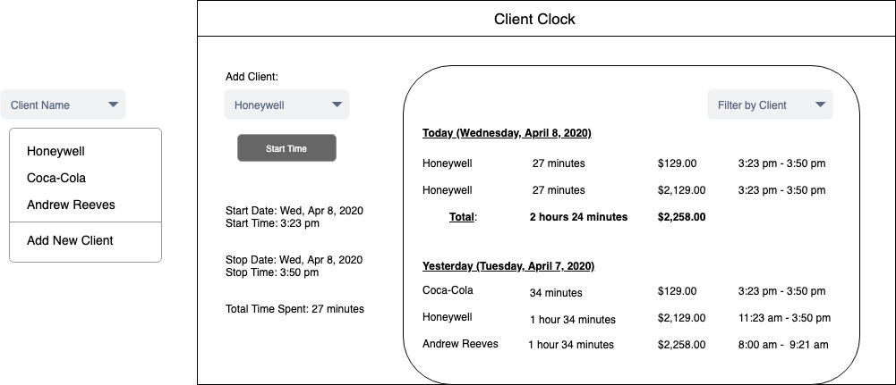

# Client Clock

## Description

*Time for your time to start making cents.*

This application is a system that will track the amount of time spent with specific clients or projects then use that information to create a billing page with hourly cost, total time, and total cost for the work done.

The live page can be viewed here: https://darkquilius.github.io/Code-wizards/


## User Story

```
AS a business worker
I WANT to be able to track the amount of time I spend on each client/project
SO THAT I can bill them accordingly
I WANT to be able to view the billing summary
SO THAT I can verify the timing and costs.
```


## Functionality

```
GIVEN a dashboard with start/stop buttons, an input and calculate button
WHEN I enter a client/project name
THEN My timers are saved to those names
WHEN I press start
THEN The timers start
WHEN I press stop
THEN My time, date and client information is saved and appended to a list.
WHEN I press calculate
THEN I am presented with a well-laid out summary of client name, my total time, hourly billing cost, and total cost.
```

## Wireframe & Sketch



## Technologies

* Bootstrap
* Moment JS
* JQuery

## Team Members

* Andrew Reeves
* Connie Tran
* Eric Jorgensen
* Karolyn Seredick
* Logan Hemphill
